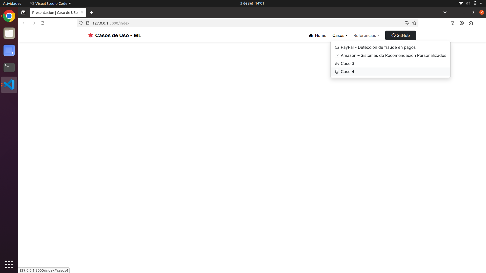

# Casos de Uso - Machine Learning

Este proyecto es una aplicación con **Flask** para presentar casos de uso de *Machine Learning*.  
Incluye estructura con **HTML + CSS + Bootstrap**, y está listo para ejecutarse en cualquier máquina usando un entorno virtual de Python.

---

### Cómo ejecutar el proyecto?

### 1️⃣ Clonar el repositorio
```bash
git clone https://github.com/emily-180/CasosUsoMachine-Learning.git
cd CasosUsoMachine-Learning
```

### 2️⃣ Crear y activar el entorno virtual
En Linux/Mac:
```bash
python3 -m venv .venv
source .venv/bin/activate
```

En Windows:
```bash
python -m venv .venv
.venv\Scripts\activate
```

### 3️⃣ Instalar dependencias
```bash
pip install -r requirements.txt
```

### 4️⃣ Ejecutar la aplicación
```bash
flask run
```
## Prints de la aplicación

*Figura 1 - Tela inicial da aplicación*
